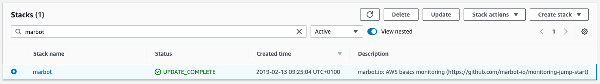
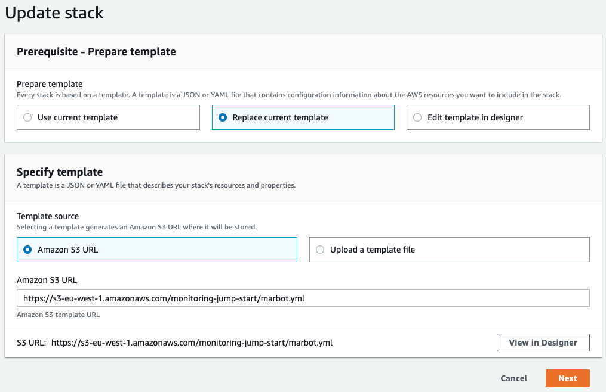
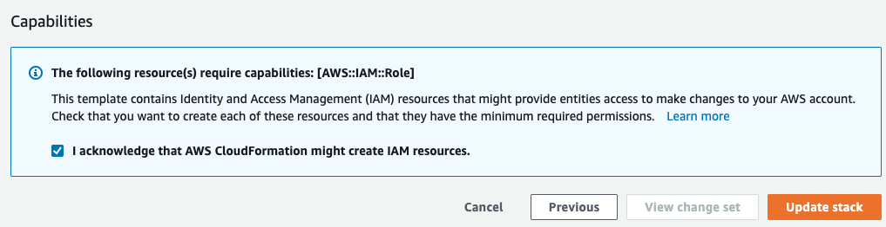

# Free Monitoring Templates for AWS CloudFormation
Setting up monitoring on AWS is hard. There are countless monitoring possibilities on AWS. Overlooking the important settings is easy. Monitoring Jump Starts connect you with all relevant AWS sources for comprehensive monitoring coverage.

Jump Starts are CloudFormation templates or [Terraform modules](https://github.com/marbot-io/monitoring-jump-start-tf) that you can deploy to your AWS account to setup CloudWatch Alarms, CloudWatch Event Rules, and much more. Events are sent to Slack or Microsoft Teams.

At the moment, you can monitor:

| Monitoring goal | CloudFormation Action | CloudFormation Template URL |
| --- | --- | --- |
| [AWS basics](marbot.yml) | [Launch Stack](https://console.aws.amazon.com/cloudformation/home#/stacks/create/review?templateURL=https://s3-eu-west-1.amazonaws.com/monitoring-jump-start/marbot.yml) | `https://s3-eu-west-1.amazonaws.com/monitoring-jump-start/marbot.yml` |
| [Application Load Balancer (ALB)](marbot-alb.yml) | [Launch Stack](https://console.aws.amazon.com/cloudformation/home#/stacks/create/review?templateURL=https://s3-eu-west-1.amazonaws.com/monitoring-jump-start/marbot-alb.yml) | `https://s3-eu-west-1.amazonaws.com/monitoring-jump-start/marbot-alb.yml` |
| [Auto Scaling Group](marbot-auto-scaling-group.yml) | [Launch Stack](https://console.aws.amazon.com/cloudformation/home#/stacks/create/review?templateURL=https://s3-eu-west-1.amazonaws.com/monitoring-jump-start/marbot-auto-scaling-group.yml) | `https://s3-eu-west-1.amazonaws.com/monitoring-jump-start/marbot-auto-scaling-group.yml` |
| [EC2 instance](marbot-ec2-instance.yml) | [Launch Stack](https://console.aws.amazon.com/cloudformation/home#/stacks/create/review?templateURL=https://s3-eu-west-1.amazonaws.com/monitoring-jump-start/marbot-ec2-instance.yml) | `https://s3-eu-west-1.amazonaws.com/monitoring-jump-start/marbot-ec2-instance.yml` |
| [EC2 instances](marbot-ec2-instances.yml) | [Launch Stack](https://console.aws.amazon.com/cloudformation/home#/stacks/create/review?templateURL=https://s3-eu-west-1.amazonaws.com/monitoring-jump-start/marbot-ec2-instances.yml) | `https://s3-eu-west-1.amazonaws.com/monitoring-jump-start/marbot-ec2-instances.yml` |
| [EFS file system](marbot-efs.yml) | [Launch Stack](https://console.aws.amazon.com/cloudformation/home#/stacks/create/review?templateURL=https://s3-eu-west-1.amazonaws.com/monitoring-jump-start/marbot-efs.yml) | `https://s3-eu-west-1.amazonaws.com/monitoring-jump-start/marbot-efs.yml` |
| [Elastic Beanstalk](marbot-elastic-beanstalk.yml) | [Launch Stack](https://console.aws.amazon.com/cloudformation/home#/stacks/create/review?templateURL=https://s3-eu-west-1.amazonaws.com/monitoring-jump-start/marbot-elastic-beanstalk.yml) and don't forget to put the [marbot-elastic-beanstalk.config](marbot-elastic-beanstalk.config) file into your .ebextensions folder! | `https://s3-eu-west-1.amazonaws.com/monitoring-jump-start/marbot-elastic-beanstalk.yml` |
| [ElastiCache memcached cluster](marbot-elasticache-memcached.yml) | [Launch Stack](https://console.aws.amazon.com/cloudformation/home#/stacks/create/review?templateURL=https://s3-eu-west-1.amazonaws.com/monitoring-jump-start/marbot-elasticache-memcached.yml) | `https://s3-eu-west-1.amazonaws.com/monitoring-jump-start/marbot-elasticache-memcached.yml` |
| [Elasticsearch domain](marbot-elasticsearch.yml) | [Launch Stack](https://console.aws.amazon.com/cloudformation/home#/stacks/create/review?templateURL=https://s3-eu-west-1.amazonaws.com/monitoring-jump-start/marbot-elasticsearch.yml) | `https://s3-eu-west-1.amazonaws.com/monitoring-jump-start/marbot-elasticsearch.yml` |
| [CloudFormation Drift Detection](marbot-cloudformation-drift.yml) | [Launch Stack](https://console.aws.amazon.com/cloudformation/home#/stacks/create/review?templateURL=https://s3-eu-west-1.amazonaws.com/monitoring-jump-start/marbot-cloudformation-drift.yml) | `https://s3-eu-west-1.amazonaws.com/monitoring-jump-start/marbot-cloudformation-drift.yml` |
| [CloudFront](marbot-cloudfront.yml) | [Launch Stack](https://console.aws.amazon.com/cloudformation/home#/stacks/create/review?templateURL=https://s3-eu-west-1.amazonaws.com/monitoring-jump-start/marbot-cloudfront.yml) | `https://s3-eu-west-1.amazonaws.com/monitoring-jump-start/marbot-cloudfront.yml` |
| [Lambda function](marbot-lambda-function.yml) | [Launch Stack](https://console.aws.amazon.com/cloudformation/home#/stacks/create/review?templateURL=https://s3-eu-west-1.amazonaws.com/monitoring-jump-start/marbot-lambda-function.yml) | `https://s3-eu-west-1.amazonaws.com/monitoring-jump-start/marbot-lambda-function.yml` |
| [NAT Gateway](marbot-nat-gateway.yml) | [Launch Stack](https://console.aws.amazon.com/cloudformation/home#/stacks/create/review?templateURL=https://s3-eu-west-1.amazonaws.com/monitoring-jump-start/marbot-nat-gateway.yml) | `https://s3-eu-west-1.amazonaws.com/monitoring-jump-start/marbot-nat-gateway.yml` |
| [RDS database instance](marbot-rds.yml) | [Launch Stack](https://console.aws.amazon.com/cloudformation/home#/stacks/create/review?templateURL=https://s3-eu-west-1.amazonaws.com/monitoring-jump-start/marbot-rds.yml) | `https://s3-eu-west-1.amazonaws.com/monitoring-jump-start/marbot-rds.yml` |
| [RDS cluster (Aurora)](marbot-rds-cluster.yml) | [Launch Stack](https://console.aws.amazon.com/cloudformation/home#/stacks/create/review?templateURL=https://s3-eu-west-1.amazonaws.com/monitoring-jump-start/marbot-rds-cluster.yml) | `https://s3-eu-west-1.amazonaws.com/monitoring-jump-start/marbot-rds-cluster.yml` |
| [Redshift cluster](marbot-redshift.yml) | [Launch Stack](https://console.aws.amazon.com/cloudformation/home#/stacks/create/review?templateURL=https://s3-eu-west-1.amazonaws.com/monitoring-jump-start/marbot-redshift.yml) | `https://s3-eu-west-1.amazonaws.com/monitoring-jump-start/marbot-redshift.yml` |
| [Repeated task](marbot-repeated-task.yml) | [Launch Stack](https://console.aws.amazon.com/cloudformation/home#/stacks/create/review?templateURL=https://s3-eu-west-1.amazonaws.com/monitoring-jump-start/marbot-repeated-task.yml) | `https://s3-eu-west-1.amazonaws.com/monitoring-jump-start/marbot-repeated-task.yml` |
| [Reserved Instance](marbot-reserved-instance) | [Launch Stack](https://console.aws.amazon.com/cloudformation/home#/stacks/create/review?templateURL=https://s3-eu-west-1.amazonaws.com/monitoring-jump-start/marbot-reserved-instance) | `https://s3-eu-west-1.amazonaws.com/monitoring-jump-start/marbot-reserved-instance.yml` |
| [SQS queue](marbot-sqs-queue.yml) | [Launch Stack](https://console.aws.amazon.com/cloudformation/home#/stacks/create/review?templateURL=https://s3-eu-west-1.amazonaws.com/monitoring-jump-start/marbot-sqs-queue.yml) | `https://s3-eu-west-1.amazonaws.com/monitoring-jump-start/marbot-sqs-queue.yml` |
| [Synthetics Website](marbot-synthetics-website.yml) | [Launch Stack](https://console.aws.amazon.com/cloudformation/home#/stacks/create/review?templateURL=https://s3-eu-west-1.amazonaws.com/monitoring-jump-start/marbot-synthetics-website.yml) | `https://s3-eu-west-1.amazonaws.com/monitoring-jump-start/marbot-synthetics-website.yml` |
| [WorkSpaces](marbot-workspaces.yml) | [Launch Stack](https://console.aws.amazon.com/cloudformation/home#/stacks/create/review?templateURL=https://s3-eu-west-1.amazonaws.com/monitoring-jump-start/marbot-workspaces.yml) | `https://s3-eu-west-1.amazonaws.com/monitoring-jump-start/marbot-workspaces.yml` |

## Update procedure

To update a Jump Start:

1. Visit the [AWS Management Console](https://console.aws.amazon.com/cloudformation/home#/stacks?filteringText=marbot).
2. Double-check the selected AWS region.
3. Search for marbot.

4. Select a stack and grab the matching **CloudFormation Template URL** from the table above (the **Description** has to match the **Monitoring goal** here!).
5. Click on **Update**.
6. Select **Replace current template** and paste the *CloudFormation Template URL* into the **Amazon S3 URL** field.

7. Click on **Next**.
8. Scroll to the bottom of the page and click on **Next**.
9. Once again, scroll to the bottom of the page and click on **Next**.
10. Scroll to the bottom of the page and select **I acknowledge that AWS CloudFormation might create IAM resources**.

11. Click on **Update stack**.
12. Repeat this procedure for every CloudFormation stack that is based on the updated Jump Starts.
13. If you use more than one AWS region, repeat the procedure for each region.

## License
All templates are published under Apache License Version 2.0.

## About
A [marbot.io](https://marbot.io/) project. Engineered by [widdix](https://widdix.net).
